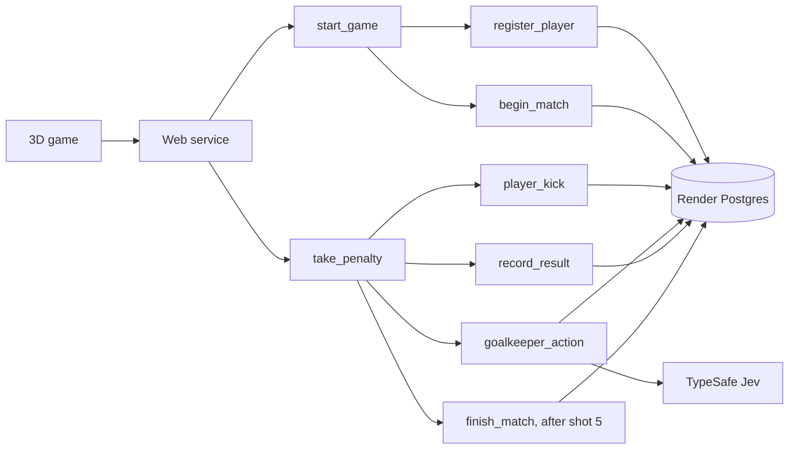

# How the game works



All match mutations happen inside real Render tasks. The web service validates commands, starts runs, and reads Postgres and Render task status. Each action starts a bounded workflow run. The application groups those runs into a match; a cloud task never sits waiting for a human to shoot.

## A penalty

1. `player_kick` locks the target in Postgres. The same penalty cannot acquire a different target on retry.
2. `goalkeeper_action` sends the current ball's projected crossing and calculated observations to Jev. It applies the chosen move to a defensive position in the same task. A typed Choice returns six defensive zones or `leave_wide`, with probabilities and confidence. The first saved response wins if retries overlap.
3. `record_result` checks the chosen zone against the ball using ordinary geometry and saves the outcome. A well-placed corner can beat the keeper's reach. Out-of-bounds balls always miss, with no dive.
4. After penalty five, `finish_match` saves the completed match. **Try again** creates a fresh match and retains this browser's totals.

The browser animates the saved result after the workflow responds. It is not a continuous cloud-controlled physics simulation. Workflow startup and network delays are visible as pending task states. The top strip shows completed match stages; its moving segment means running, not a predicted completion percentage. The right-side execution panel shows real task IDs, statuses, and elapsed times across the entire match. Expand Jev’s move for the exact request and response.

## Why this Jev input

The original history-only prompt asked Jev to predict an unseen shot. That supplied no evidence of the current ball. The revised request provides current state and explicit shooter-side directions. Code calculates exact geometry and descriptive observations; Jev selects the action. This is a small example of typed action selection, not evidence that AI is needed for football geometry. See <a href="research.md" target="_blank" rel="noopener noreferrer">source review and prompt checks</a>.

## Files and reuse

- `typescript/src/` and `python/app/`: independent APIs, workflow definitions, Postgres storage, rules, and Jev adapters.
- `shared/game.json`: the common prompt, action descriptions, goal zones, and reach. `keeper.ts` / `keeper.py` own the TypeSafe calls.
- `frontend/src/`: React Three Fiber scene, character posing, UI, and workflow progress. Both backends serve the same frontend.
- `frontend/public/models/`: a CC0 human rig by Quaternius, with license and source. Football materials and poses are authored here. Rebuild the mesh with `scripts/prepare-character.py` and the free Standard pack.
- `render.yaml` and `python/render.yaml`: separate paid web services, usage-billed workflows, and paid databases. Each Blueprint prompts for TypeSafe and Render API keys and wires the database and workflow automatically.

A Postgres row lock makes each state change atomic. Identical retries reuse the saved decision and result; conflicting targets are rejected. Parent tasks have no automatic retries. Child tasks retry twice. The UI's **Retry** repeats the same command and cannot count a penalty twice.

## Player records

A random browser token identifies the player. Only its hash is stored with matches. Names are nicknames, not logins. Records do not follow you to another browser. Matches and traces require the same token. There is no public leaderboard.

Render receives task arguments and results. TypeSafe receives current shot observations, not the nickname. Postgres retains the nickname, shots, and decisions until an operator deletes them. API rate limits are per process and IP, a basic demo safeguard.

## Verify

```sh
npm run build
npm test
PYTHONPATH=python python/.venv/bin/python -m unittest discover -s python
node --env-file=.env --import tsx tests/keeper-live.ts
node tests/live-smoke.mjs http://127.0.0.1:3101
node tests/live-smoke.mjs http://127.0.0.1:3102
node tests/ui-smoke.mjs
render blueprints validate render.yaml
render blueprints validate python/render.yaml
```

Live checks call TypeSafe, Render, and Postgres. UI checks use installed Google Chrome. GitHub may strip README new-tab attributes; app links use them directly.
