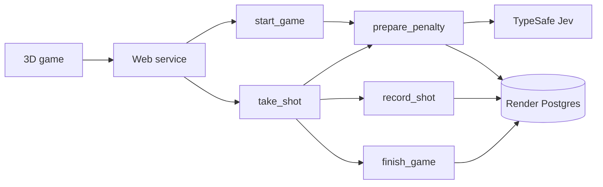

# How the game works



All match mutations happen inside Render tasks. The web service validates requests, starts runs, and reads the database and actual Render task status. Separate root runs are grouped by match in the application; a worker never waits for human input.

`prepare_penalty` sends only completed shot coordinates and outcomes to Jev. It saves one of six typed defensive zones, probabilities, confidence, and measured API duration. It does not send the nickname or next target. Completed decisions are reused on retry. The first preparation has no player history; later turns provide context, not model training.

`record_shot` resolves the submitted target against the committed keeper zone. The goal and keeper reach are simple geometry shared through `shared/game.json`. Wide shots keep the keeper standing. `finish_game` marks a five-shot match complete. The browser animates the stored result; it does not calculate or report its own score.

A Postgres row lock makes each shot atomic. A match ID plus penalty number identifies an attempt. Identical retries return the saved result; conflicting targets are rejected. Parent runs have no automatic retry; child tasks retry twice. The visible Retry button repeats the same command and resumes from saved state. Automatic preparation overlaps the result animation. Workflows can add delay, so the UI shows actual pending status instead of pretending every shot is instantaneous.

## Files

- `typescript/src/` and `python/app/`: independent APIs, workflow definitions, storage, rules, and Jev adapters.
- `frontend/src/GameScene.tsx`: original 3D geometry and animation using Three.js / React Three Fiber (MIT).
- `shared/`: game rules, types, and attribution links.
- `database/schema.sql`: one small matches table.
- `render.yaml` and `python/render.yaml`: complete independent deployments. Task compute uses `flex` in code.

## Player records

A random browser token identifies a player. Only its hash is stored with matches. Names are display names, not logins. Records do not follow the player to another browser. Matches and traces require the same player token. Public responses exclude the next keeper decision. No public leaderboard or account system.

Render receives task arguments and return values; TypeSafe receives shot history. Postgres retains the player's name, shots, and decisions until the operator deletes them. Use a nickname. API rate limits are per web-process IP and are a demo safeguard, not a comprehensive abuse system.

## Verify

```sh
npm run build
npm test
python/.venv/bin/python -m unittest discover -s python -p 'test_*.py'
node tests/live-smoke.mjs http://127.0.0.1:3101
node tests/live-smoke.mjs http://127.0.0.1:3102
node tests/ui-smoke.mjs
render blueprints validate render.yaml
render blueprints validate python/render.yaml
```

Live tests call TypeSafe, Render, and Postgres. UI checks use installed Google Chrome. GitHub may strip new-tab attributes from README links; the deployed app uses them directly.
