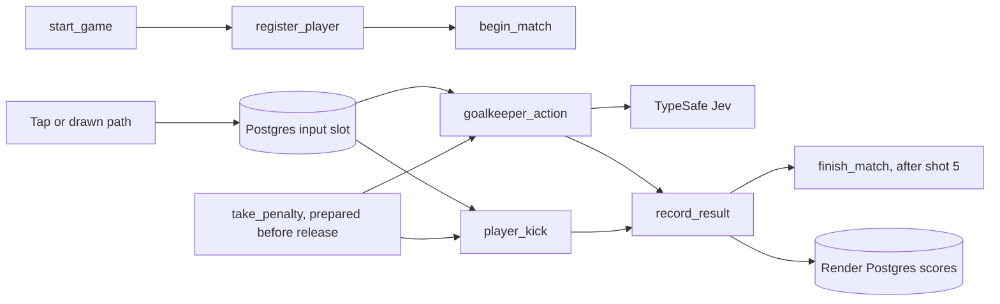

# How the game works



## Play and execution

1. Enter a nickname. `start_game` registers the player and starts the match.
2. The app prepares `take_penalty`. It starts `player_kick` and `goalkeeper_action` **in parallel**, with `Promise.all` in TypeScript and `asyncio.gather` in Python. Both tasks wait on a durable Postgres input slot, on separate Render instances.
3. Once both are ready, tap a target or draw a path. Release starts the browser animation immediately and submits the immutable path. A grass tap becomes a ground-level shot, never an underground ball.
4. The player task locks the accepted shot. Independently, the keeper task calls Jev and publishes its decision as soon as it returns. The browser applies that move during flight. Jev receives the path, projected crossing, and calculated lane/height observations.
5. `record_result` waits for both tasks, resolves the outcome, and commits the score. After shot five, `finish_match` completes the match. **Try again** retains this browser's totals.

The tasks' waiting window is bounded to 90 seconds. An abandoned turn ends without taking a shot. The UI offers Retry to prepare another window. This trades a small amount of waiting compute for a responsive release; it does not make task startup instantaneous. The next turn prepares while the previous result is displayed.

## Reaction deadline

The decision window is **850 ms from release**, before the ball's 1.3-second flight ends. The browser estimates its clock offset from API responses; the API clamps the submitted timestamp to its clock and the previous five seconds. Input transit, task wakeup, and the TypeSafe call consume that window. Clock estimation is approximate, suitable for a demo, not a competitive timing system.

A missed deadline or unavailable provider leaves the keeper still. No late answer is credited with a save. Normal decisions show both end-to-end reaction time and the separate TypeSafe request time. The animation's clock does not restart when a response arrives. Result text waits until the ball arrives. Slow connections can delay result confirmation.

Game geometry determines whether the ball is within the goal and within the keeper's reach. Jev selects a typed action; it does not perform image recognition or calculate collision physics. This small game could use rules for action selection. It demonstrates a typed decision under a time limit, not evidence that AI is necessary for football geometry. See <a href="research.md" target="_blank" rel="noopener noreferrer">the source review</a>.

## What the panel shows

The right panel reads real Render task IDs, statuses, start/end times, and retries. Player input and keeper decision rows overlap. Their elapsed times include waiting for the player. Match milestones come from workflow-persisted state. The browser renders the scene locally; animation frames are not cloud tasks.

## Files and deployment

- `typescript/src/` and `python/app/`: independent APIs, tasks, storage, input coordination, rules, and TypeSafe adapters.
- `shared/game.json`: prompt, actions, geometry, and timing. `keeper.ts` / `keeper.py` own the TypeSafe calls.
- `frontend/src/`: React Three Fiber scene, pointer-to-path conversion, playback, and real task history. Both examples share this frontend.
- `frontend/public/models/`: CC0 human rig by Quaternius. Kit materials and poses are authored here.
- `render.yaml` and `python/render.yaml`: independent paid web services, usage-billed workflows, and paid Postgres databases. Blueprints prompt for TypeSafe and Render API keys and wire database connections and workflow slugs.

Postgres locks and immutable input slots prevent retries from changing the path or counting a shot twice. The first saved keeper response wins. The API accepts input and reads state; the workflow tasks accept the kick, choose the keeper move, and commit scores. A failed TypeSafe call is not retried beyond the reaction window. Other child tasks retry twice; parent tasks do not retry automatically.

## Records and checks

A random browser token identifies the player; the database stores its hash. Nicknames are not logins, and records do not follow you to another browser. Matches and traces require the same token. There is no public leaderboard. Render receives task inputs and outputs. TypeSafe receives the shot path and observations, not the nickname. Postgres retains nicknames, input paths, and scores until an operator deletes them. Rate limits are per process and IP.

```sh
npm run build
npm test
PYTHONPATH=python python/.venv/bin/python -m unittest discover -s python
node tests/live-smoke.mjs http://127.0.0.1:3101
node tests/live-smoke.mjs http://127.0.0.1:3102
node tests/ui-smoke.mjs
node tests/interaction.mjs
render blueprints validate render.yaml
render blueprints validate python/render.yaml
```

Live checks call TypeSafe, Render, and Postgres. UI checks use installed Chrome. They cover the reported center miss, drawn paths, delayed input, actual task overlap, retry safety, and refresh recovery. GitHub may strip README new-tab attributes; app links use them directly.
