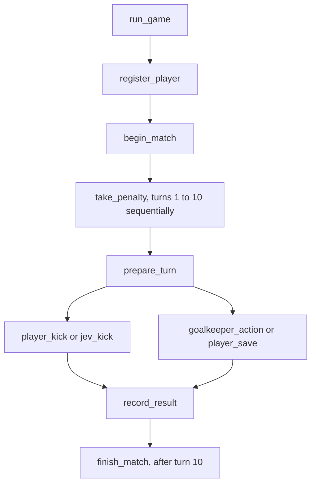

# How the shootout works

One match is one `run_game` task run. Five rounds each contain your kick followed by Jev's kick.



`run_game` calls each penalty using `ctx.run`. Inside the penalty, player and goalkeeper tasks run together with `Promise.all` in TypeScript or `asyncio.gather` in Python. They wait for the same Postgres input slot. Saving the result joins both tasks. The API starts only the match root. Every other task is its descendant.

## Playing

- **Your kick:** tap a target or draw a path. Release starts the local animation immediately. Jev sees the current path and calculated lane/height, then chooses a typed defensive action.
- **Jev's kick:** Jev chooses a typed target using only completed goalkeeper history. That target is stored before the UI enables **Ready in goal**. The API does not reveal it until release. Use Left/Right or A/D to move; hold Space, Up, or W to jump. Touch buttons provide the same controls. The keeper position is frozen at impact and submitted once.
- Five kicks each, most goals wins. Equal scores are a draw. **Try again** starts a new root run and keeps this browser's human goals/attempts.

The white kit is always you; purple is always Jev. The players swap roles. Results and score changes appear after ball arrival. The right panel shows one match ID, ten nested turns, actual Render task IDs, statuses, timestamps, and retries. Task durations include waiting for input. Animation frames and key events run locally.

## Timing and recovery

Jev has 850 ms from your release to choose a save. Browser clock calibration is approximate; network transit and inference consume that window. A late or unavailable answer cannot save. The ball takes 180 ms of run-up and 1,300 ms of flight. The browser does not restart the ball clock when a decision arrives. The keeper moves toward Jev's chosen zone, never the exact shot coordinates. A fast decision waits until the final 650 ms of flight to dive, reaching the zone at ball arrival. Late browser delivery still requires at least 450 ms of movement. Saves use the zone's reach area, not a simulated glove collision.

For your save, controls stop at impact. The API allows five seconds from release for the final position to arrive. Missing input counts as a missed save. This is a browser game demonstration, not an authoritative multiplayer or anti-cheat system. A client could forge its position. AI and human turns also use different decision windows, so scores do not measure general intelligence.

Each turn waits up to 90 seconds for release. If abandoned, the match closes without inventing another kick. A whole match is bounded to 20 minutes. Waiting tasks use compute. Task preparation still takes time; it happens while the preceding result is displayed.

Postgres row locks protect score updates. Immutable input, target, reaction, and defense records preserve the first accepted action on retry. Repeat start requests reuse the stored root ID. This does not claim exactly-once submission across a server crash between the Render request and database commit. Child tasks retry twice; parent and penalty tasks do not automatically replay. If a task ultimately fails, start a new match; completed scores remain stored.

## Modules and data

- Each SDK folder has its own API, workflow, storage, input coordination, game rules, and TypeSafe adapter. Both use the shared React Three Fiber frontend.
- `shared/game.json` holds the save/shot questions, action criteria, geometry, and timing.
- `keeper.ts` and `keeper.py` own both TypeSafe calls. Jev receives structured observations, not images or nicknames. Code resolves collisions.
- Render Postgres stores nicknames, paths, goalkeeper inputs, and scores. A hashed browser token gates matches and traces. There is no public leaderboard or cross-browser login.
- Blueprints independently deploy paid web services, usage-billed workflows, and paid Postgres. They prompt for TypeSafe and Render API keys.
- The human rig is Quaternius CC0, with source credit in `frontend/public/models`.

## Verification

```sh
npm run build
npm test
PYTHONPATH=python python/.venv/bin/python -m unittest discover -s python
node tests/live-smoke.mjs http://127.0.0.1:3101
node tests/live-smoke.mjs http://127.0.0.1:3102
node tests/ui-smoke.mjs
render blueprints validate render.yaml
render blueprints validate python/render.yaml
```

Live tests call TypeSafe, Render, and Postgres. They verify a complete match, one root with sequential penalty descendants and overlapping player/keeper children, hidden targets, keyboard/touch controls, timing, score integrity, retries, ownership, reload, and Try again. These are implementation checks, not a novice usability study. GitHub may strip README new-tab attributes; app links use them directly.
